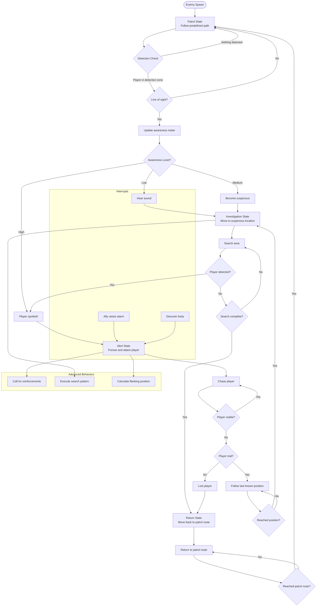

Enemy AI Flow chat

```mermaid
flowchart TD
	Start([Enemy Spawn]) --> Patrol
	
	%% Main States
	Patrol[Patrol State\nFollow predefined path] --> DetectionCheck
	Investigate[Investigation State\nMove to suspicious location] --> InvestigateArea
	Alert[Alert State\nPursue and attack player] --> ChasePlayer
	Return[Return State\nMove back to patrol route] --> ReturnToPath
	
	%% Detection System
	DetectionCheck{Detection Check} -->|Player in detection zone| VisibilityCheck
	DetectionCheck -->|Nothing detected| Patrol
	VisibilityCheck{Line of sight?} -->|Yes| CalculateAwareness
	VisibilityCheck -->|No| Patrol
	
	%% Awareness System
	CalculateAwareness[Update awareness meter] --> AwarenessCheck
	AwarenessCheck{Awareness Level?} -->|Low| HearSound
	AwarenessCheck -->|Medium| BecomeSuspicious
	AwarenessCheck -->|High| SpotPlayer
	
	%% Sound Detection
	HearSound[Hear sound] --> Investigate
	
	%% Suspicion
	BecomeSuspicious[Become suspicious] --> Investigate
	
	%% Investigation Logic
	InvestigateArea[Search area] --> PlayerFoundCheck
	PlayerFoundCheck{Player detected?} -->|Yes| SpotPlayer
	PlayerFoundCheck -->|No| InvestigationTimeCheck
	InvestigationTimeCheck{Search complete?} -->|Yes| Return
	InvestigationTimeCheck -->|No| InvestigateArea
	
	%% Alert Logic
	SpotPlayer[Player spotted!] --> Alert
	ChasePlayer[Chase player] --> PlayerVisibleCheck
	PlayerVisibleCheck{Player visible?} -->|Yes| ChasePlayer
	PlayerVisibleCheck -->|No| PlayerLostCheck
	PlayerLostCheck{Player trail?} -->|Yes| FollowTrail
	PlayerLostCheck -->|No| LostPlayer
	
	%% Following Logic
	FollowTrail[Follow last known position] --> LastPositionReached
	LastPositionReached{Reached position?} -->|Yes| Investigate
	LastPositionReached -->|No| FollowTrail
	
	%% Return Logic
	LostPlayer[Lost player] --> Return
	ReturnToPath[Return to patrol route] --> ReturnCheck
	ReturnCheck{Reached patrol route?} -->|Yes| Patrol
	ReturnCheck -->|No| ReturnToPath
	
	%% Special Events
	subgraph Interrupts
		HearSound
		AllyAlert[Ally raises alarm] --> Alert
		FindBody[Discover body] --> Alert
	end
	
	%% Optional States
	subgraph Advanced Behaviors
		RaiseAlarm[Call for reinforcements]
		SearchPattern[Execute search pattern]
		FlankPosition[Calculate flanking position]
	end
	
	Alert --> RaiseAlarm
	Investigate --> SearchPattern
	Alert --> FlankPosition
```
